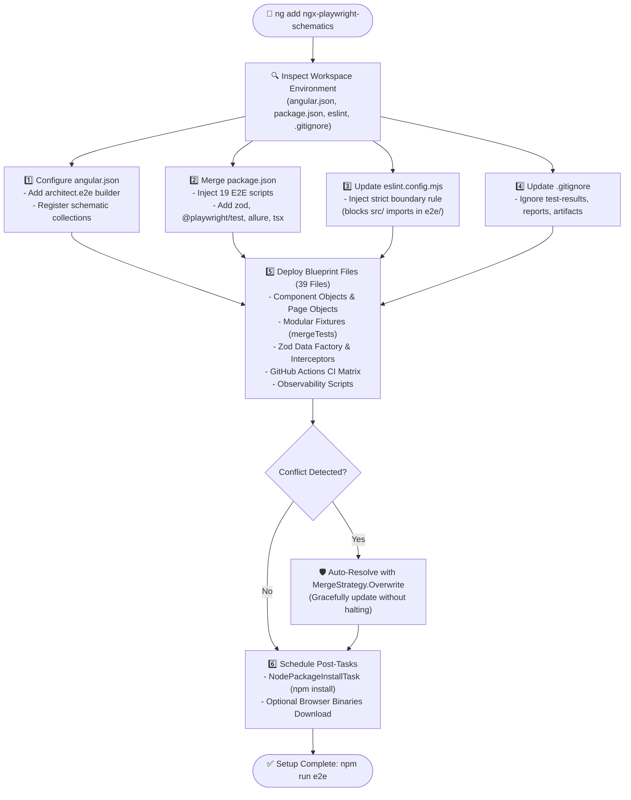
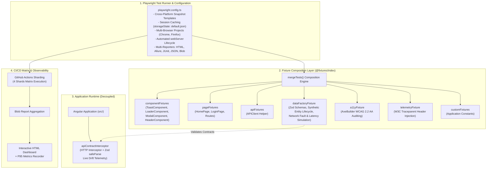

# 🎭 ngx-playwright-schematics

[](https://www.npmjs.com/package/ngx-playwright-schematics)
[](LICENSE)
[](https://angular.dev)
[](https://playwright.dev)

An enterprise-grade Angular Schematics package that automates setting up and scaffolding a production-ready **Playwright E2E testing architecture** into any Angular application.

---

## ⚡ Quick Start

In any Angular project root directory, simply run:

```bash
ng add ngx-playwright-schematics
```

Or run via generator:

```bash
ng g ngx-playwright-schematics:ng-add
```

### CLI Options

| Option | Type | Default | Description |
| :--- | :--- | :--- | :--- |
| `--project` | `string` | *(default project)* | Specific project name in `angular.json` |
| `--installBrowsers` | `boolean` | `false` | Automatically install Playwright browser binaries |
| `--overwrite` | `boolean` | `true` | Safely resolve conflicts and update existing configuration |

Example with options:
```bash
ng add ngx-playwright-schematics --project=my-app --installBrowsers=true --overwrite=true
```

---

## 🔄 Schematic Execution Lifecycle

When you run `ng add ngx-playwright-schematics`, the schematic executes an idempotent, conflict-resilient pipeline:



---

## 🏛️ Scaffolded Enterprise Architecture

The blueprint implements industry best practices for enterprise testing at scale:



---

## 🧩 Architectural Pillars

### 1. Strict Source Decoupling (Rule 1)
E2E test suites (`e2e/`) remain completely isolated from application source code (`src/`). An ESLint `no-restricted-imports` rule is automatically injected to prevent leaking internal Angular implementations into test suites.

### 2. Component Object Model over BasePage Inheritance (Rule 2)
Avoid monolithic inheritance chains. UI widgets are encapsulated as standalone Component Objects and composed directly into fixtures:

```typescript
import { test, expect } from '@fixtures/index';

test('verify user dashboard', { tag: ['@smoke', '@ui'] }, async ({ homePage, toastComponent }) => {
  await homePage.visit();
  await toastComponent.verifyNoFatalErrors();
});
```

### 3. Modular Fixture Slicing via `mergeTests()` (Rule 3)
Fixtures are sliced into focused domain concerns (`componentFixtures`, `pageFixtures`, `apiFixtures`, `a11yFixture`, `dataFactoryFixture`, `telemetryFixture`) and combined in `@fixtures/index`.

```typescript
import { mergeTests } from '@playwright/test';
export const test = mergeTests(
  componentFixtures,
  pageFixtures,
  apiFixtures,
  a11yFixture,
  dataFactoryFixture,
  telemetryFixture
);
```

### 4. Pre-Cached Authentication (`storageState`) (Rule 4)
User authentication is executed once during global setup (`auth.setup.ts`) and cached to `e2e/auth/default.json`. Browser workers reuse this cached session instantly. Unauthenticated flows opt out with:
```typescript
test.use({ storageState: { cookies: [], origins: [] } });
```

### 5. Cross-Platform Snapshot Consistency (Rule 5)
`snapshotPathTemplate` formats screenshots deterministically (`{snapshotDir}/{arg}-{projectName}-{platform}{ext}`), preventing visual mismatch failures across macOS local dev and Linux CI runners.

### 6. Angular HTTP Contract Interceptor (Rule 8)
An Angular `HttpInterceptorFn` validates all live HTTP responses against Zod schemas in real-time. Contract drifts are reported to browser console / telemetry without breaking the UI.

---

## 🛠️ Command Reference

After running `ng add ngx-playwright-schematics`, your `package.json` includes:

| Script | Command | Purpose |
| :--- | :--- | :--- |
| `npm run e2e` | `ng e2e` | Full E2E suite headless with auto-started dev server |
| `npm run e2e:smoke` | `playwright test --grep @smoke` | P0 fast smoke suite for quick PR feedback |
| `npm run e2e:regression` | `playwright test --grep @regression` | Complete regression test suite |
| `npm run e2e:a11y` | `playwright test --grep @a11y` | Automated WCAG 2.2 AA accessibility audit scans |
| `npm run e2e:visual` | `playwright test --grep @visual` | Visual snapshot regression tests |
| `npm run e2e:api` | `playwright test --grep @api` | Zod API contract and fault resilience specs |
| `npm run e2e:ui` | `playwright test --ui` | Interactive UI Mode with time-travel & DOM snapshots |
| `npm run e2e:headed` | `playwright test --headed` | Run tests in a visible browser window |
| `npm run e2e:debug` | `playwright test --debug` | Step-by-step Playwright Inspector debugging |
| `npm run e2e:report` | `playwright show-report artifacts/playwright-report` | Open Playwright HTML report |
| `npm run allure:report` | `npm run allure:generate && allure open ...` | Generate and view Allure report |
| `npm run insights:all` | `tsx scripts/...` | Record execution metrics, P95 duration, and build HTML dashboard |
| `npm run lint:e2e` | `npx eslint e2e` | Enforce E2E source decoupling guardrails |

---

## 📁 Scaffolded File Tree

```
.
├── .github/
│   └── workflows/
│       ├── e2e.yml                       # Pull request CI workflow
│       └── e2e-matrix.yml                # 4-shard matrix execution & report merger
├── e2e/
│   ├── auth/
│   │   └── default.json                  # Pre-cached session storageState
│   ├── components/
│   │   ├── header.component.ts           # Header / navbar widget
│   │   ├── loader.component.ts           # Loading spinners & progress bars
│   │   ├── modal.component.ts            # Dialog modals (role="dialog")
│   │   └── toast.component.ts            # Status toasts & alerts
│   ├── fixtures/
│   │   ├── a11yFixture.ts                # AxeBuilder accessibility fixture
│   │   ├── apiFixtures.ts                # API client fixture
│   │   ├── componentFixtures.ts          # COM widget fixtures
│   │   ├── constants.ts                  # App titles & timeouts
│   │   ├── creds.ts                      # Credentials manager
│   │   ├── dataFactoryFixture.ts         # Zod schemas, synthetic lifecycle, network faults
│   │   ├── fixtures.ts                   # Custom test data fixtures
│   │   ├── index.ts                      # Unified mergeTests export
│   │   ├── pageFixtures.ts               # Page Object fixtures
│   │   └── telemetryFixture.ts           # W3C traceparent header injection
│   ├── global/
│   │   ├── global-setup.ts               # Global setup hook
│   │   └── global-teardown.ts            # Global teardown hook
│   ├── helpers/
│   │   ├── apiClient.ts                  # Isolated API client
│   │   └── utils.ts                      # Playwright helper utilities
│   ├── pages/
│   │   ├── homePage.ts                   # Home Page Object
│   │   ├── loginPage.ts                  # Login Page Object
│   │   ├── routes.ts                     # Central route dictionary
│   │   └── testExtender.ts               # Test extender re-export
│   ├── specs/
│   │   ├── a11y.spec.ts                  # WCAG 2.2 AA accessibility spec
│   │   ├── api-contract.spec.ts          # Zod contract validation & fault specs
│   │   ├── app.spec.ts                   # Core application specs
│   │   ├── auth.setup.ts                 # Pre-cached authentication setup
│   │   └── visual.spec.ts                # Visual snapshot regression specs
│   └── tsconfig.json                     # E2E TypeScript paths configuration
├── scripts/
│   ├── lib/
│   │   └── parseResults.ts               # Playwright JSON report parser
│   ├── html-reporter.ts                  # Interactive HTML execution dashboard
│   ├── markdown-summary.ts               # GitHub step summary markdown report
│   ├── metrics-recorder.ts               # Daily test metrics & P95 duration recorder
│   └── tsconfig.json                     # Scripts TypeScript configuration
├── src/
│   └── app/
│       └── core/
│           └── interceptors/
│               └── api-contract.interceptor.ts  # Angular HTTP Zod Contract Interceptor
├── eslint.config.mjs                     # Decoupled ESLint configuration
└── playwright.config.ts                  # Enterprise Playwright configuration
```

---

## 📄 License

Apache-2.0
